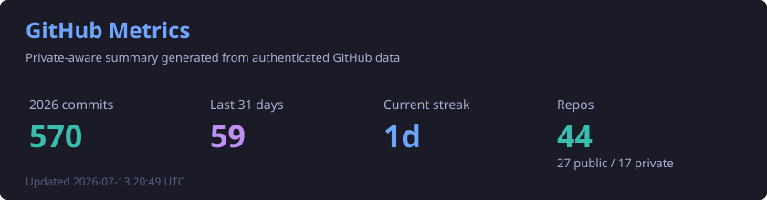
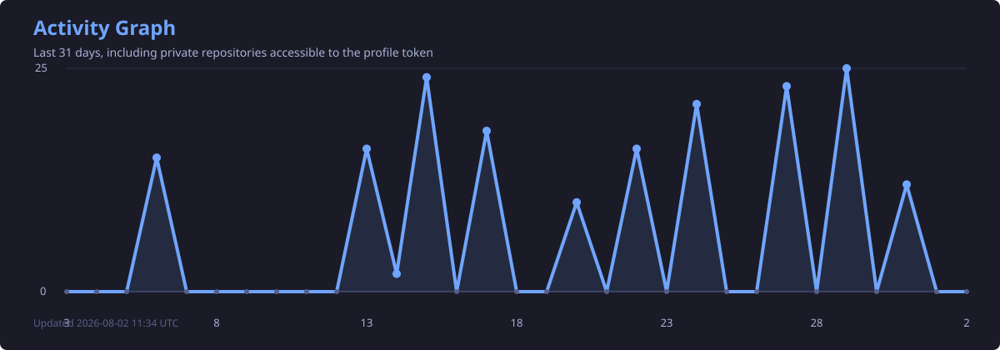

<div align="center">
  
</div>

<p align="center">
  
</p>

<p align="center">
  
  
  
</p>

---

## About

I am a full stack engineer focused on turning business ideas into usable software: CRMs, commercial platforms, internal tools, automations, marketplaces and web products that need to survive real users.

My work usually sits at the intersection of **product thinking**, **backend architecture**, **frontend execution** and **deployment ownership**. I like systems that are clear enough to maintain, fast enough to use every day, and flexible enough to keep evolving.

---

## Core Stack

<p align="center">
  
</p>

<table>
  <tr>
    <td width="33%">
      <strong>Backend</strong><br />
      .NET, PHP/Laravel, Node.js, REST APIs, auth flows, integrations and business rules.
    </td>
    <td width="33%">
      <strong>Frontend</strong><br />
      React, Vue, TypeScript, dashboards, admin panels and responsive product interfaces.
    </td>
    <td width="33%">
      <strong>Data & Cloud</strong><br />
      MySQL, PostgreSQL, migrations, production deploys, Azure servers and operational handoff.
    </td>
  </tr>
</table>

---

## Product Areas

| Area | What I build |
| --- | --- |
| SaaS & CRM | Sales workflows, dashboards, user roles, client records and business automation |
| Marketplaces | Job flows, user management, transactions, matching and operational panels |
| Social Platforms | Profiles, feeds, matching logic, engagement loops and private interactions |
| Internal Systems | Backoffice tools, document automation, desktop utilities and process software |

---

## Featured Work

| Platform | Focus | Stack |
| --- | --- | --- |
| **Gerenciamento de Propostas** | B2B proposal management with tracking, analytics and digital workflow | PHP, JavaScript, SQL |
| **CRM Enterpriserh** | Commercial CRM migrated from Railway to Azure production infrastructure | TypeScript, Node.js, PostgreSQL, Azure |
| **Aviv** | Affiliate and membership platform with digital card and monetization logic | PHP, JavaScript, SQL |
| **Amora** | Social platform combining matching and content interaction | Web platform architecture |
| **FreellizV2** | Freelancer marketplace inspired by Workana-style workflows | Marketplace architecture |

---

## GitHub Analytics

<p align="center">
  
</p>

## Activity

<p align="center">
  
</p>

---

## Engineering Focus

```text
Architecture   Modular systems, API design, clean data flow
Product        CRM, SaaS, marketplaces, internal tools
Frontend       React, Vue, TypeScript, dashboards
Backend        .NET, PHP/Laravel, Node.js
Data           PostgreSQL, MySQL, migrations, reporting
Cloud          Azure deploys, Linux servers, production operations
```

<div align="center">
  <strong>Building products with code, shipping them into the real world, and keeping them useful after launch.</strong>
</div>

<div align="center">
  
</div>
